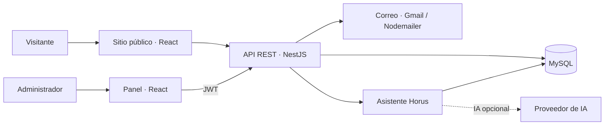

<div align="center">
  

  <h1>Horus Group · Plataforma Web</h1>

  <p><strong>Tecnología, formación y atención al cliente en un mismo espacio.</strong></p>
  <p>Sitio corporativo · Panel administrativo · Asistente virtual</p>

  <p>
    
    
    
    
    
  </p>

  <p>
    <a href="#vision-general">Visión general</a> ·
    <a href="#instalacion-local">Instalación</a> ·
    <a href="#configuracion">Configuración</a> ·
    <a href="#api">API</a> ·
    <a href="#despliegue">Despliegue</a>
  </p>
</div>

---

<a id="vision-general"></a>
## Visión general

**Horus Group** es una plataforma web para presentar los servicios tecnológicos y la oferta educativa de Horus Group SRL, recibir solicitudes de clientes y centralizar la gestión de contenido desde un panel administrativo.

El repositorio reúne una aplicación React y una API REST en NestJS con persistencia en MySQL. Incluye un asistente que consulta el catálogo publicado para orientar a los visitantes y facilitar el contacto con el equipo.

### Funcionalidades

| Área | Alcance |
| --- | --- |
| **Sitio corporativo** | Inicio, información institucional, galería, market y páginas de políticas. |
| **Servicios tecnológicos** | Cableado estructurado, cámaras de seguridad y soporte y mantenimiento. |
| **Educación** | Cursos, capacitaciones y asesoramiento. |
| **Atención al cliente** | Formulario de contacto, suscripción a newsletter y libro de reclamaciones. |
| **Panel administrativo** | Dashboard, gestión de catálogo, galería, mensajes, reclamaciones, cotizaciones, suscriptores y ajustes. |
| **Publicación de contenido** | Cursos, servicios y preguntas frecuentes con estados de borrador, publicado y archivado. |
| **Asistente Horus** | Menú guiado, consultas al catálogo público y formulario para solicitar atención; redacción con IA opcional. |
| **Acceso administrativo** | Autenticación con JWT y contraseñas protegidas mediante bcrypt. |

> **Estado de integración:** el panel y el chatbot consultan la API. Varias páginas públicas conservan contenido estático; editar el catálogo no sustituye automáticamente esos textos. La base se inicializa sin datos de ejemplo y el asistente necesita registros publicados para ofrecer información del catálogo.

## Arquitectura y tecnologías



| Capa | Tecnologías |
| --- | --- |
| Frontend | React 19, TypeScript 5, Vite 8 y React Router 6. |
| Interfaz | CSS, Tailwind CSS 4 y notificaciones con Sonner. |
| Backend | NestJS 10, TypeScript, Sequelize y controlador mysql2. |
| Autenticación y validación | Passport, JWT, bcryptjs, class-validator y class-transformer. |
| Documentación y pruebas | Swagger / OpenAPI y ejecutor de pruebas de Node.js. |

### Estructura del repositorio

```text
Proyecto-Horus-/
├── README.md
├── backend/
│   ├── src/                 # Módulos de la API, modelos, DTOs y autenticación
│   ├── scripts/             # Inicialización, migraciones y creación de administradores
│   ├── migrations/          # Cambios versionados del esquema
│   ├── test/                # Pruebas del backend
│   ├── .env.example         # Plantilla de configuración
│   ├── chatbot.env.example  # Configuración opcional del asistente con IA
│   └── CHATBOT.md           # Funcionamiento y alcance del asistente
└── frontend/
    ├── public/              # Logo, iconos y fotografías públicas
    └── src/
        ├── pages/           # Páginas del sitio
        ├── components/      # Componentes compartidos y chatbot
        ├── panel/           # Administración, sesión y servicios de API
        ├── layouts/         # Estructura visual del sitio
        ├── assets/          # Recursos gráficos
        └── styles/          # Estilos por sección
```

<a id="instalacion-local"></a>
## Instalación local

### Requisitos

- **Node.js 22.13 o superior dentro de la rama 22.x**, para el entorno de NestJS y Vite del proyecto.
- **npm**, incluido con Node.js.
- Un servidor **MySQL** accesible y credenciales con permisos para crear las tablas.
- **Git**, si vas a clonar el repositorio.

Los comandos se ejecutan desde la raíz, salvo que se indique otra ubicación. Backend y frontend tienen sus propias dependencias y archivos de bloqueo.

### 1. Obtener el proyecto e instalar dependencias

```sh
git clone https://github.com/Castope/Proyecto-Horus-.git
cd Proyecto-Horus-
npm --prefix backend ci
npm --prefix frontend ci
```

### 2. Configurar el backend

Copia `backend/.env.example` como `backend/.env`. En PowerShell:

```powershell
Copy-Item backend/.env.example backend/.env
```

Si ya tienes un `.env`, conserva tu configuración. Completa las credenciales de MySQL y establece un `JWT_SECRET` propio de al menos 32 caracteres. Mantén `DB_SYNC=false`.

### 3. Preparar la base de datos

Para una instalación nueva, crea una base **vacía** desde tu cliente MySQL:

```sql
CREATE DATABASE horus_db CHARACTER SET utf8mb4 COLLATE utf8mb4_unicode_ci;
```

Comprueba que su nombre coincida con `DB_NAME`. Después ejecuta:

```sh
npm --prefix backend run db:init
npm --prefix backend run db:migrate
```

`db:init` compila el backend y crea las tablas iniciales; rechaza bases que ya contienen tablas. `db:migrate` aplica las migraciones pendientes, incluida la de cotizaciones. Ninguno crea contenido de ejemplo.

**Si la base ya contiene el esquema del proyecto**, ejecuta únicamente `db:migrate`. Realiza un respaldo antes de migrar una base con datos: los cambios DDL de MySQL no cuentan con rollback transaccional.

### 4. Crear el primer administrador

El comando solicita nombre y correo, y toma la contraseña de `ADMIN_INITIAL_PASSWORD`. Este ejemplo de PowerShell la solicita sin mostrarla y retira la variable al terminar:

```powershell
$adminCredential = Get-Credential -UserName 'admin' -Message 'Define la contraseña del administrador (mínimo 8 caracteres)'
try {
    $env:ADMIN_INITIAL_PASSWORD = $adminCredential.GetNetworkCredential().Password
    npm --prefix backend run admin:create
} finally {
    Remove-Item Env:ADMIN_INITIAL_PASSWORD -ErrorAction SilentlyContinue
    $adminCredential = $null
}
```

El usuario del diálogo no define la cuenta: introduce el nombre y correo reales cuando el script los solicite. La contraseña debe tener al menos 8 caracteres y no superar 72 bytes en UTF-8. El comando requiere la tabla `admin_users` y no sobrescribe cuentas existentes.

El endpoint de registro de administradores requiere un JWT administrativo; la primera cuenta se crea mediante este script.

### 5. Iniciar la aplicación

Abre dos terminales en la raíz:

```sh
# Terminal 1: API
npm --prefix backend run start:dev
```

```sh
# Terminal 2: sitio y panel
npm --prefix frontend run dev
```

| Acceso | Dirección local predeterminada |
| --- | --- |
| Sitio web | http://localhost:5173 |
| Inicio de sesión administrativo | http://localhost:5173/admin/login |
| Panel administrativo | http://localhost:5173/admin/dashboard |
| Swagger | http://localhost:3000/api/docs |

Vite redirige las peticiones `/api` a `http://localhost:3000` durante el desarrollo. Si cambias el puerto del backend, actualiza el proxy en `frontend/vite.config.js`. Si Vite selecciona otro puerto, inclúyelo en `CORS_ORIGINS`.

<a id="configuracion"></a>
## Configuración

La configuración del servidor se guarda en `backend/.env`; la plantilla está en [backend/.env.example](backend/.env.example).

| Variable | Uso |
| --- | --- |
| `PORT` | Puerto de la API; por defecto, `3000`. |
| `DB_HOST`, `DB_PORT` | Dirección y puerto de MySQL. |
| `DB_NAME`, `DB_USER`, `DB_PASS` | Base de datos y credenciales de conexión. |
| `JWT_SECRET` | Secreto de firma de los tokens administrativos. |
| `DB_SYNC` | Creación automática de tablas en desarrollo; mantener `false` al usar los scripts de inicialización y migración. |
| `NODE_ENV` | Entorno de ejecución: `development` o `production`. |
| `CORS_ORIGINS` | Orígenes permitidos separados por comas, sin rutas ni barra final. En desarrollo hay valores locales predeterminados. |
| `DB_SSL`, `DB_SSL_CA` | TLS y certificado CA opcional para la conexión a MySQL. |
| `MAIL_USER`, `MAIL_PASS` | Cuenta Gmail y contraseña de aplicación para notificaciones y constancias por correo. |

Guarda las credenciales únicamente en el entorno del servidor. Las variables expuestas por Vite forman parte del cliente y no deben contener secretos.

### Asistente Horus

El chatbot funciona por defecto **sin un proveedor de IA**: busca por palabras clave en cursos, servicios y preguntas frecuentes publicados. Incluye navegación guiada y permite enviar una solicitud de atención al panel con consentimiento del visitante.

Para la configuración opcional de IA, consulta [backend/chatbot.env.example](backend/chatbot.env.example) y la [guía del chatbot](backend/CHATBOT.md). Si el proveedor falla o no está configurado, el asistente vuelve a las respuestas del catálogo.

El asistente no confirma reservas ni inscripciones. Su conversación permanece en memoria del navegador y no se guarda como historial en la base de datos.

<a id="api"></a>
## API

Todas las rutas del servidor utilizan el prefijo `/api`. Con el backend en marcha, abre [Swagger local](http://localhost:3000/api/docs) para consultar los contratos y probar las operaciones.

| Grupo | Rutas principales | Acceso |
| --- | --- | --- |
| Autenticación | `POST /api/admin/login` | Público |
| Cuenta administrativa | `POST /api/admin/register`, `GET /api/admin/me` | JWT |
| Catálogo | `/api/cursos`, `/api/servicios`, `/api/preguntas-frecuentes` | Lectura pública de contenido publicado |
| Gestión del catálogo | `/api/admin/cursos`, `/api/admin/servicios`, `/api/admin/preguntas-frecuentes` | JWT |
| Atención | `POST /api/contacto`, `POST /api/reclamaciones`, `POST /api/newsletter` | Público |
| Chatbot | `POST /api/chatbot/message`, `POST /api/chatbot/contact` | Público, con límites de solicitudes |
| Administración | `/api/admin/stats`, `/api/admin/messages`, `/api/admin/reclamaciones`, `/api/admin/cotizaciones` | JWT |
| Contenido y ajustes | `/api/admin/galeria`, `/api/admin/newsletter`, `/api/admin/settings` | JWT |

Para probar rutas protegidas, inicia sesión y pega el token en **Authorize** de Swagger. En peticiones HTTP directas utiliza `Authorization: Bearer <token>`.

Los listados del catálogo admiten `page`, `limit` y `search`, con un máximo de 100 registros por página. La administración admite además el filtro `estado`. Eliminar un recurso del catálogo lo archiva; los borradores y archivados quedan fuera de las consultas públicas.

## Comandos de desarrollo

Ejecuta desde la raíz:

| Comando | Propósito |
| --- | --- |
| `npm --prefix frontend run dev` | Iniciar Vite en desarrollo. |
| `npm --prefix frontend run check` | Comprobar los tipos de TypeScript. |
| `npm --prefix frontend run lint` | Ejecutar ESLint. |
| `npm --prefix frontend run build` | Comprobar tipos y generar `frontend/dist`. |
| `npm --prefix frontend run preview` | Previsualizar la compilación del frontend. |
| `npm --prefix backend run start:dev` | Iniciar NestJS con recarga. |
| `npm --prefix backend run build` | Compilar el servidor en `backend/dist`. |
| `npm --prefix backend run start:prod` | Ejecutar el backend compilado. |
| `npm --prefix backend test` | Ejecutar las pruebas del backend. |
| `npm --prefix backend run db:init` | Inicializar una base vacía. |
| `npm --prefix backend run db:migrate` | Aplicar las migraciones pendientes. |
| `npm --prefix backend run admin:create` | Crear una cuenta administrativa. |

Las pruebas del backend cubren catálogo, chatbot, configuración de despliegue y regresiones con sustitutos de base de datos. No requieren MySQL y no reemplazan una comprobación de persistencia con una base real.

Como verificación funcional, inicia sesión, crea y publica un curso, consúltalo desde el chatbot y envía una solicitud de atención. Comprueba que aparezca en el panel y que el curso deje de estar disponible públicamente al archivarlo.

<a id="despliegue"></a>
## Despliegue

Frontend y backend se compilan por separado. El repositorio incluye [configuración de Vercel para el backend](backend/vercel.json).

- **Frontend:** genera `frontend/dist` con `npm --prefix frontend run build`. Configura el alojamiento para resolver las rutas de React Router mediante `index.html`.
- **API:** compila con `npm --prefix backend run build`; en un servidor Node.js persistente, inicia con `npm --prefix backend run start:prod`.
- **Enrutamiento:** el cliente utiliza rutas relativas `/api`. Configura un proxy o una reescritura hacia el backend; el proxy de desarrollo de Vite no forma parte de los archivos compilados.
- **Entorno:** establece `NODE_ENV=production`, `DB_SYNC=false`, credenciales reales, un `JWT_SECRET` de al menos 32 caracteres y `CORS_ORIGINS` con los orígenes HTTPS exactos del frontend.
- **Base de datos:** utiliza MySQL accesible desde el servidor, habilita TLS si lo requiere el proveedor y ejecuta la preparación del esquema como una operación explícita, fuera del proceso de compilación del alojamiento.

El servidor valida la configuración de producción al arrancar. Los límites del chatbot se mantienen en memoria por proceso; un despliegue con varias instancias necesita un limitador compartido para controlar el tráfico de forma global.

## Alcance actual

- La integración del catálogo con todas las páginas públicas está pendiente.
- Los administradores comparten permisos; los roles granulares y la recuperación de contraseña están pendientes.
- Las imágenes del catálogo se gestionan mediante URL; la subida de archivos no está implementada.
- La búsqueda del asistente se basa en palabras clave, sin embeddings ni entrenamiento adicional.

## Documentación complementaria

- [Backend: catálogo, autenticación y pruebas](backend/README.md).
- [Asistente Horus: uso, configuración y límites](backend/CHATBOT.md).
- [Plan de trabajo del panel y chatbot](PLAN_PANEL_Y_CHATBOT.md).

Para la instalación inicial, sigue los pasos de este README, que incluyen el script `db:init` y las migraciones actuales. El plan de trabajo es una referencia de evolución; no todas sus propuestas representan funciones implementadas.

## Licencia

El repositorio no incluye un archivo `LICENSE` y el paquete del backend está marcado como `UNLICENSED`. No se declara una licencia de código abierto.
